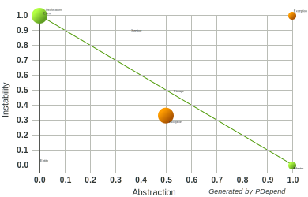
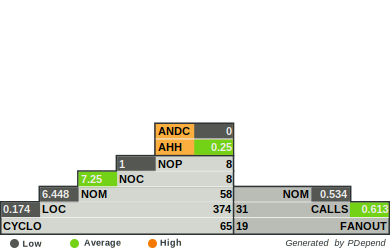

# Geolocation

[![Build status][Master image]][Master]
[![Coverage Status][Master coverage image]][Master coverage]
[![Code Climate][Code Climate image]][Code Climate]
[![Packagist][Packagist image]][Packagist]

[![License][License image]][License]

## Installation

Install via composer:

```console
$ composer require aist/geolocation
```

## Configuration
If you are using zend-component-installer it automatically registers module in modules.config.php
```
return [
    ...
    'Aist\Geolocation',
    ...
];
```

## Usage
```
$service = $sm->get(GeolocationService::class);
$location = $service->getLocation();
```

## Interfaces
- \Aist\Geolocation\Adapter\AdapterInterface
- \Aist\Geolocation\Storage\StorageInterface

## Listeners
- \Aist\Geolocation\Event\LocationListener

| package dependencies                | software metrics                    |
| ----------------------------------- | ----------------------------------- |
|  |  |

[](https://codeclimate.com/github/ma-si/geolocation/maintainability)
[](https://codeclimate.com/github/ma-si/geolocation/test_coverage)


  [Master image]: https://img.shields.io/travis/ma-si/geolocation/master.svg?style=flat-square
  [Master]: https://secure.travis-ci.org/ma-si/geolocation
  [Master coverage image]: https://img.shields.io/coveralls/ma-si/geolocation/master.svg?style=flat-square
  [Master coverage]: https://coveralls.io/r/ma-si/geolocation?branch=master
  [Code Climate image]: https://img.shields.io/codeclimate/github/ma-si/geolocation.svg?style=flat-square
  [Code Climate]: https://codeclimate.com/github/ma-si/geolocation
  [Packagist image]: https://img.shields.io/packagist/v/aist/geolocation.svg?style=flat-square
  [Packagist]: https://packagist.org/packages/aist/geolocation
  [License image]: https://poser.pugx.org/aist/geolocation/license?format=flat-square
  [License]: https://opensource.org/licenses/BSD-3-Clause
